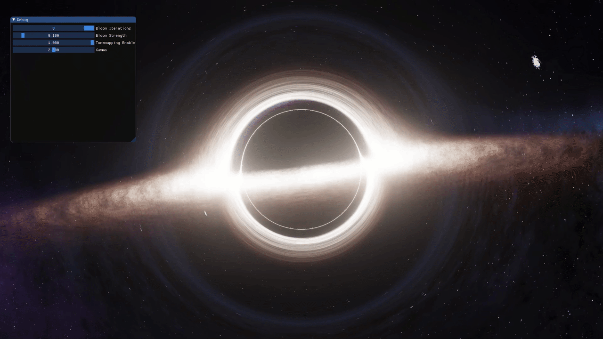

# Real-time Black Hole Rendering in OpenGL



A real-time renderer implementing general relativistic effects around Schwarzschild black holes.

## Features

- **Gravitational Lensing**: Light bending near massive objects
- **Accretion Disk Rendering**: Procedural multi-wavelength disk
- **Relativistic Doppler Effects**: Spectral shifting and beaming
- **Photon Sphere Visualization**: Light trapping at 1.5 Schwarzschild radii
- **Adaptive Ray Marching**: Stable integration near event horizon

### Dependencies
- OpenGL 4.6+
- GLFW 3.3
- GLM 0.9.9+
- CMake 3.12

## Build & Run
```
git clone https://github.com/WalkingDevFlag/BlackHole
cd BlackHole
./Blackhole.sh build
./Blackhole.sh run
```

## Technical Approach

Implements General Relativity through:
- Schwarzschild metric tensor calculations
- Null geodesic integration in GLSL
- Adaptive Runge-Kutta integration
- Relativistic radiative transfer approximation

Based on theoretical work from:
- Gravitational Lensing in Astrophysics[1]
- O. Semerak's Light Ray Approximations[1]
- Yamashita's Rasterization Framework[1]


## Issues:

Areas needing contribution:
- Kerr metric implementation
- Spectral line simulation
- GPU memory optimization

## License

MIT License - See LICENSE.md for details

## Acknowledgements
**Papers**
- [Gravitational Lensing by Spinning Black Holes in Astrophysics, and in the Movie Interstellar](https://arxiv.org/pdf/1502.03808.pdf)
- [Trajectory Around A Spherically Symmetric Non-Rotating Black Hole - Sumanta](https://arxiv.org/pdf/1109.0676)
- [Approximating Light Rays In The Schwarzschild Field - O. Semerak](https://arxiv.org/pdf/1412.5650)
- [Implementing a Rasterization Framework for a Black Hole Spacetime - Yoshiyuki Yamashita](https://www.semanticscholar.org/paper/Implementing-a-Rasterization-Framework-for-a-Black-Yamashita/90a9b04b7153462da9d8edecdfa8262bdd689a4c?p2df)

**Articles**
- [Physics of oseiskar.github.io/black-hole](https://oseiskar.github.io/black-hole/docs/physics.html)
- [Schwarzschild geodesics](https://en.wikipedia.org/wiki/Schwarzschild_geodesics)
- [Photons and black holes](https://flannelhead.github.io/posts/2016-03-06-photons-and-black-holes.html)
- [A real-time simulation of the visual appearance of a Schwarzschild Black Hole](http://spiro.fisica.unipd.it/~antonell/schwarzschild/)
- [Ray Tracing a Black Hole in C# by Mikolaj Barwicki](https://www.codeproject.com/Articles/994466/Ray-Tracing-a-Black-Hole-in-Csharp)
- [Ray Marching and Signed Distance Functions](http://jamie-wong.com/2016/07/15/ray-marching-signed-distance-functions/)
- [Einstein's Rings and the Fabric of Space](https://www.youtube.com/watch?v=Rl8H4XEs0hw)
- [Opus 2, GLSL ray tracing tutorial](http://fhtr.blogspot.com/2013/12/opus-2-glsl-ray-tracing-tutorial.html)
- [Ray Tracing in One Weekend](https://raytracing.github.io/)
- [On ray casting, ray tracing, ray marching and the like](https://hugi.scene.org/online/hugi37/hugi%2037%20-%20coding%20adok%20on%20ray%20casting,%20ray%20tracing,%20ray%20marching%20and%20the%20like.htm)

**Other GitHub Projects**
- https://github.com/sirxemic/Interstellar
- https://github.com/ssloy/tinyraytracer
- https://github.com/RayTracing/raytracing.github.io
- https://awesomeopensource.com/projects/raytracing
- https://github.com/oseiskar/black-hole
- https://rantonels.github.io/starless/
- https://github.com/rantonels/schwarzschild
